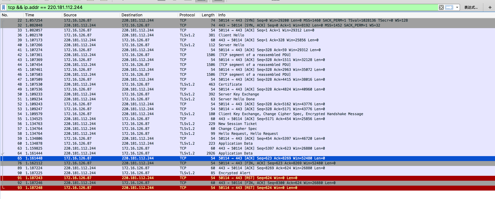

# Https协议详解

## Https协议握手过程
> 使用baidu首页作为例子，根据tcpdump抓包查看https握手实现加密传输的过程
1. tcpdump -w tcpdump.cap
2. wget https://www.baidu.com/
3. 下载tcpdump.cap 导入wireshark中查看

>以下是tcpdump的记录:

        1. 00:17:14.907052 IP neo2008cat.50116 > 220.181.112.244.https: Flags [S], seq 4229799700, win 29200, options [mss 1460,sackOK,TS val 1173743 ecr 0,nop,wscale 7], length 0
        2. 00:17:14.941560 IP 220.181.112.244.https > neo2008cat.50116: Flags [S.], seq 1036237580, ack 4229799701, win 8192, options [mss 1452,sackOK,nop,nop,nop,nop,nop,nop,nop,nop,nop,nop,nop,wscale 5], length 0
        3. 00:17:14.941572 IP neo2008cat.50116 > 220.181.112.244.https: Flags [.], ack 1, win 229, length 0
        4. 00:17:14.941693 IP neo2008cat.50116 > 220.181.112.244.https: Flags [P.], seq 1:328, ack 1, win 229, length 327
        5. 00:17:14.976487 IP 220.181.112.244.https > neo2008cat.50116: Flags [.], ack 328, win 812, length 0
        6. 00:17:14.976567 IP 220.181.112.244.https > neo2008cat.50116: Flags [P.], seq 1:59, ack 328, win 812, length 58
        7. 00:17:14.976577 IP neo2008cat.50116 > 220.181.112.244.https: Flags [.], ack 59, win 229, length 0
        8. 00:17:14.976794 IP 220.181.112.244.https > neo2008cat.50116: Flags [P.], seq 59:4824, ack 328, win 812, length 4765
        9. 00:17:14.976805 IP neo2008cat.50116 > 220.181.112.244.https: Flags [.], ack 4824, win 303, length 0
        10. 00:17:14.979165 IP 220.181.112.244.https > neo2008cat.50116: Flags [P.], seq 4824:5162, ack 328, win 812, length 338
        11. 00:17:14.979166 IP 220.181.112.244.https > neo2008cat.50116: Flags [P.], seq 5162:5171, ack 328, win 812, length 9
        12. 00:17:14.979176 IP neo2008cat.50116 > 220.181.112.244.https: Flags [.], ack 5162, win 326, length 0
        13. 00:17:14.979180 IP neo2008cat.50116 > 220.181.112.244.https: Flags [.], ack 5171, win 326, length 0
        14. 00:17:14.979516 IP neo2008cat.50116 > 220.181.112.244.https: Flags [P.], seq 328:454, ack 5171, win 326, length 126
        15. 00:17:15.014252 IP 220.181.112.244.https > neo2008cat.50116: Flags [.], ack 454, win 812, length 0
        16. 00:17:15.014564 IP 220.181.112.244.https > neo2008cat.50116: Flags [P.], seq 5171:5346, ack 454, win 812, length 175
        17. 00:17:15.014564 IP 220.181.112.244.https > neo2008cat.50116: Flags [P.], seq 5346:5352, ack 454, win 812, length 6
        18. 00:17:15.014565 IP 220.181.112.244.https > neo2008cat.50116: Flags [P.], seq 5352:5397, ack 454, win 812, length 45
        19. 00:17:15.014609 IP neo2008cat.50116 > 220.181.112.244.https: Flags [.], ack 5397, win 349, length 0
        20. 00:17:15.014679 IP neo2008cat.50116 > 220.181.112.244.https: Flags [P.], seq 454:623, ack 5397, win 349, length 169
        21. 00:17:15.049362 IP 220.181.112.244.https > neo2008cat.50116: Flags [.], ack 623, win 844, length 0
        22. 00:17:15.051346 IP 220.181.112.244.https > neo2008cat.50116: Flags [P.], seq 5397:8269, ack 623, win 844, length 2872
        23. 00:17:15.051350 IP neo2008cat.50116 > 220.181.112.244.https: Flags [.], ack 8269, win 394, length 0
        24. 00:17:15.052018 IP neo2008cat.50116 > 220.181.112.244.https: Flags [F.], seq 623, ack 8269, win 394, length 0
        25. 00:17:15.086641 IP 220.181.112.244.https > neo2008cat.50116: Flags [.], ack 624, win 844, length 0
        26. 00:17:15.086754 IP 220.181.112.244.https > neo2008cat.50116: Flags [P.], seq 8269:8300, ack 624, win 844, length 31
        27. 00:17:15.086763 IP neo2008cat.50116 > 220.181.112.244.https: Flags [R], seq 4229800324, win 0, length 0
        28. 00:17:15.086755 IP 220.181.112.244.https > neo2008cat.50116: Flags [F.], seq 8300, ack 624, win 844, length 0
        29. 00:17:15.086768 IP neo2008cat.50116 > 220.181.112.244.https: Flags [R], seq 4229800324, win 0, length 0
> 以下是wireshark的截图信息:

> 比较经典有趣的解释http握手过程:
[一个故事讲完https](http://mp.weixin.qq.com/s/StqqafHePlBkWAPQZg3NrA)
